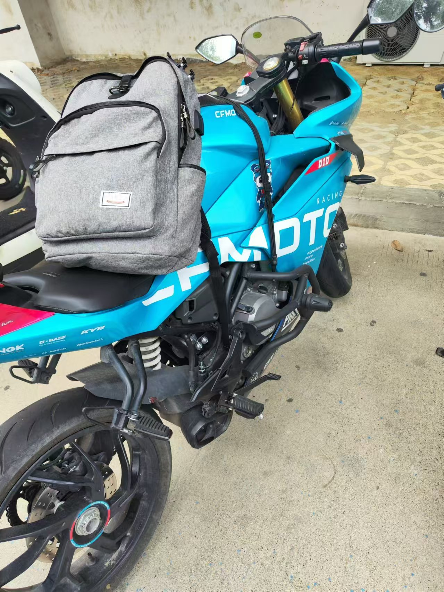
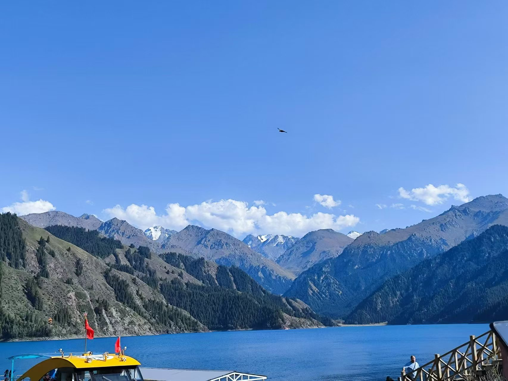
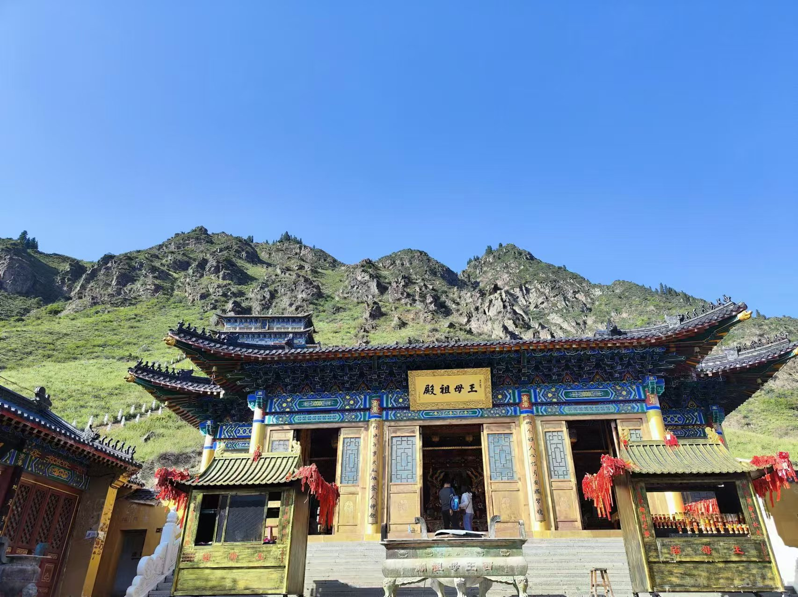
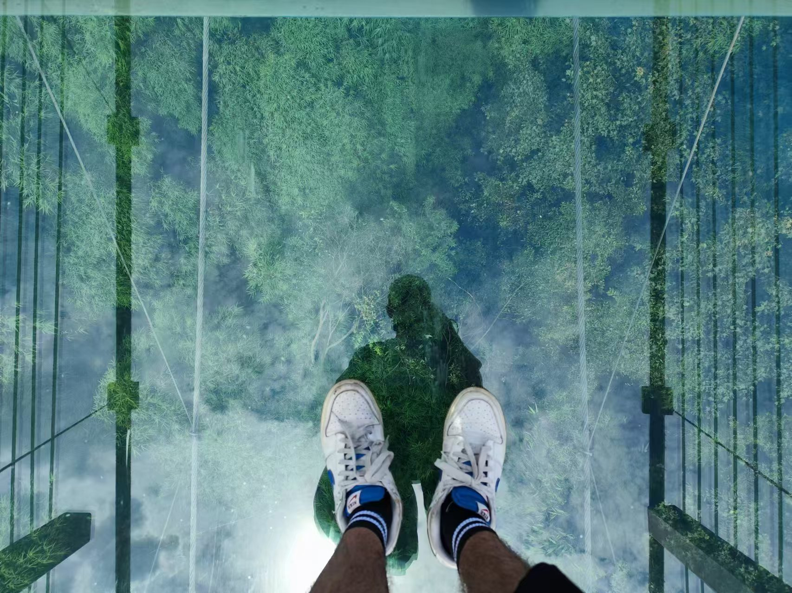
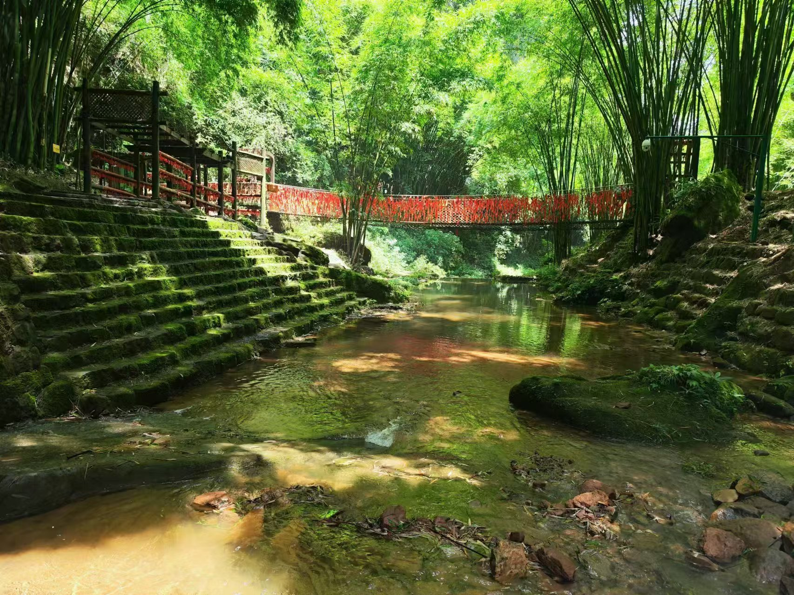

### 👋 Welcome.
---

This is Shuang Wang (王爽)

---

🌱 Personal profile

I am currently pursuing my Ph.D. degree in Earth Exploration and Information Technology, supervisor by Prof. Xuben Wang.

Here are some of my <a href="/papers/">papers</a> and <a href="/talks/">presentations</a>.

---

🔭 Research interest

I am currently working on:

Deep learning based AEM denoising, forward modeling and inversion.

Deep learning based seismic reconstruction.

<!-- .slide -->

### On The Way

  

<!-- .slide vertical=true -->

  

  

<!-- .slide vertical=true -->

  

  

